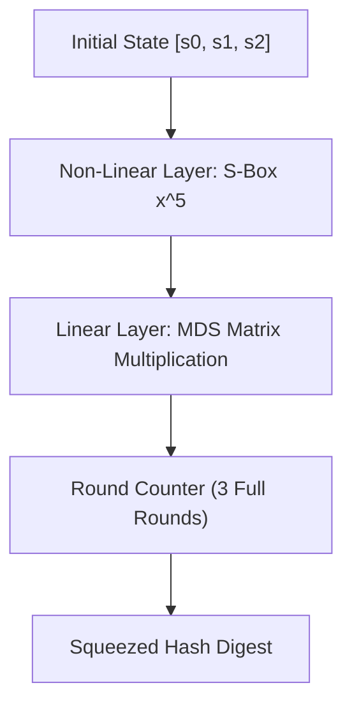

# Poseidon Algebraic Hash Skill

High-efficiency, zero-dependency Python implementation of the **Poseidon Algebraic Hash Function** optimized for ZK-SNARK and STARK circuits.

## Features
- **Low Algebraic Degree**: Employs \(x^5\) power S-box permutations minimizing R1CS gate constraints.
- **Maximum Distance Separable (MDS)**: Linear diffusion layers guaranteeing branch number security against differential cryptanalysis.
- **Zero External Dependencies**: Pure Python standard library.
- **Native MCP Protocol**: JSON-RPC 2.0 stdio server compatible with Claude Desktop, Cursor, and Windsurf.

## Architecture

